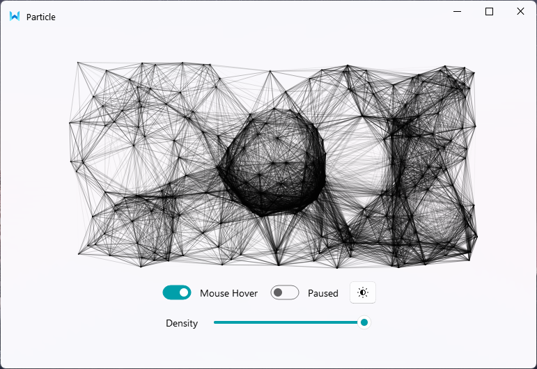
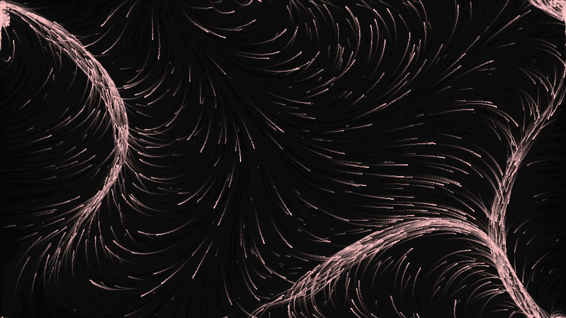
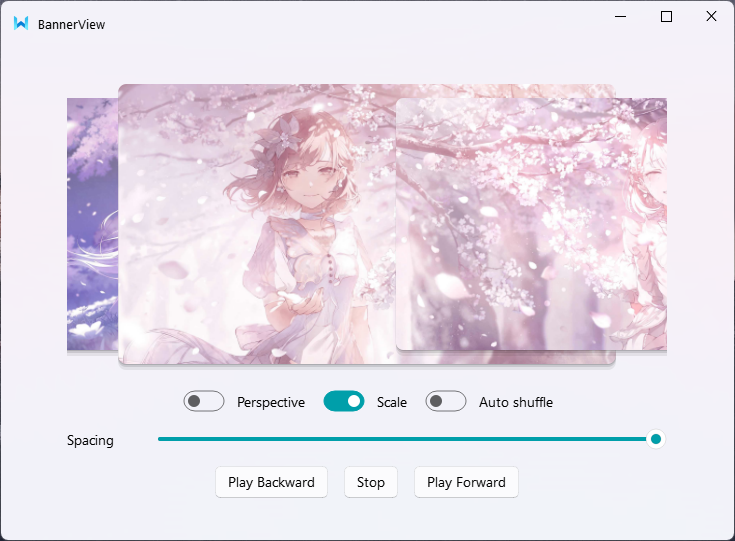
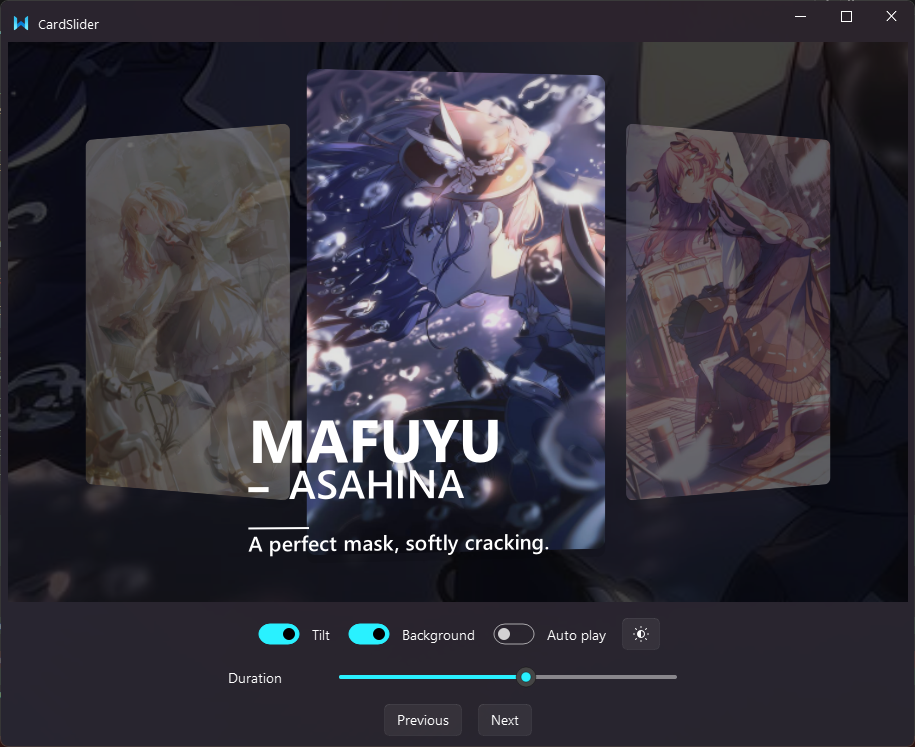
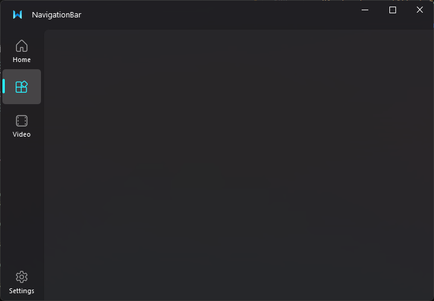
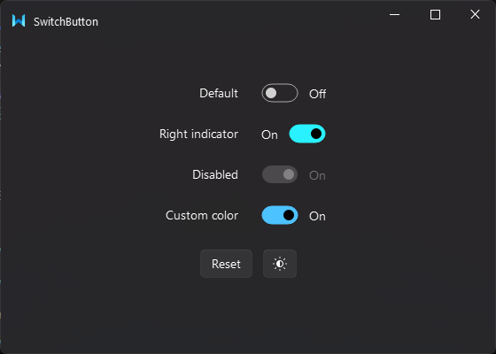
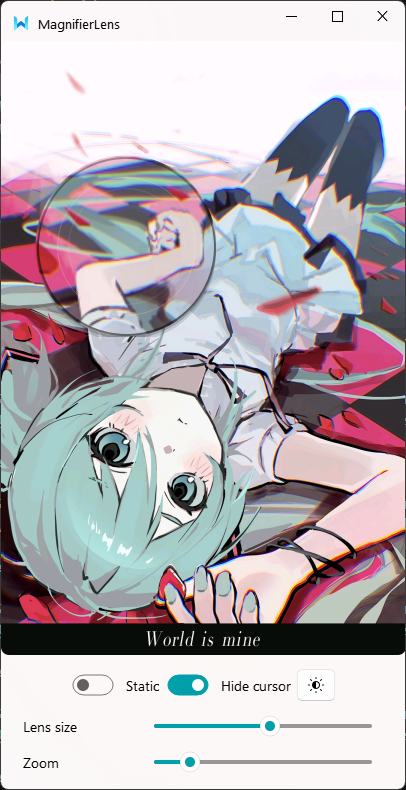



    
    <h1>My QWidget Sekai</h1>
    

  

    

| 主题 | 图片 | 运行入口 | 文件名 | 视频演示 |
| :--- | :--- | :--- | :--- | :--- |
| 粒子背景组件 |  | `pyqt_project/Particle/src/demo.py` | `Particle` | [BV1mjLE6ME1o](https://www.bilibili.com/video/BV18bLK6rEsj) |
| 流场背景组件 | | `pyqt_project/FlowField/src/demo.py` | `FlowField` | [BV1uFLY6jEjU](https://www.bilibili.com/video/BV1uFLY6jEjU) |
| 轮播横幅组件 |  | `pyqt_project/BannerView/src/demo.py` | `BannerView` | [BV18bLK6rEsj](https://www.bilibili.com/video/BV1mjLE6ME1o) |
| 卡片轮播组件 |    | `pyqt_project/CardSlider/src/demo.py` | `CardSlider` | [BV1WoL26yE7M](https://www.bilibili.com/video/BV1WoL26yE7M) |
| 微软商店导航动效 |  | `pyqt_project/MSNavigationBar/src/demo.py` | `MSNavigationBar` |[BV1FHLG6rEHa](https://www.bilibili.com/video/BV1FHLG6rEHa)|
| 开关按钮动效 |  | `pyqt_project/SwitchButton/src/demo.py` | `SwitchButton` | [BV1ArLL6sEJy](https://www.bilibili.com/video/BV1ArLL6sEJy) |
| 放大镜组件 |  | `pyqt_project/MagnifierLens/src/demo.py` | `MagnifierLens` |[BV18mLU6bEYV](https://www.bilibili.com/video/BV18mLU6bEYV) |

 
注：Demo 仅使用 pip 包 <code>qfluentwidgets</code> 提供窗口、按钮、样式和主题控件

## 参考

- [**Anime_jiamian** : QT/Vulakn渲染的项目们](https://github.com/daishuboluo/Anime_jiamian)
- [**DevWinUI** : A collection of useful classes, controls, styles, and codes for WinUI 3](https://github.com/ghost1372/DevWinUI.git)
- [**PyQt-Fluent-Widgets** : A fluent design widgets library based on C++ Qt/PyQt/PySide](https://github.com/zhiyiYo/PyQt-Fluent-Widgets)

